# Architecture Guide for Re-platforming
## Senior Navigator: GCP & Cost Planner Core Patterns

**Purpose**: This document explains the architectural patterns, data flows, and key interactions in the Senior Navigator prototype to aid re-implementation in a new technology stack.

**Audience**: Development teams rebuilding this system in Java, C#, TypeScript, or other languages.

---

## Table of Contents

1. [System Overview](#system-overview)
2. [Core Architectural Patterns](#core-architectural-patterns)
3. [GCP (Guided Care Plan) Deep Dive](#gcp-guided-care-plan-deep-dive)
4. [Cost Planner Deep Dive](#cost-planner-deep-dive)
5. [MCIP (Master Care Intelligence Panel)](#mcip-master-care-intelligence-panel)
6. [Data Flows & Interactions](#data-flows--interactions)
7. [JSON Configuration System](#json-configuration-system)
8. [LLM Integration Patterns](#llm-integration-patterns)
9. [State Management & Persistence](#state-management--persistence)
10. [Implementation Checklist](#implementation-checklist)

---

## System Overview

### High-Level Architecture

```
┌─────────────────────────────────────────────────────────────┐
│                        User Interface                         │
│                     (Streamlit / Web UI)                      │
└─────────────────────────────────────────────────────────────┘
                              │
                              ▼
┌─────────────────────────────────────────────────────────────┐
│                     Product Layer                             │
│  ┌──────────────┐  ┌──────────────┐  ┌──────────────┐      │
│  │     GCP      │  │ Cost Planner │  │     PFMA     │      │
│  │   (v4)       │  │    (v2)      │  │    (v3)      │      │
│  └──────────────┘  └──────────────┘  └──────────────┘      │
└─────────────────────────────────────────────────────────────┘
                              │
                              ▼
┌─────────────────────────────────────────────────────────────┐
│                     Module Engine                             │
│         (JSON-driven assessment orchestration)                │
└─────────────────────────────────────────────────────────────┘
                              │
                              ▼
┌─────────────────────────────────────────────────────────────┐
│                Business Logic Layer                           │
│  ┌─────────────┐  ┌─────────────┐  ┌─────────────┐         │
│  │  Scoring    │  │ LLM Engine  │  │   Flags     │         │
│  │  Engine     │  │  (Optional) │  │   Builder   │         │
│  └─────────────┘  └─────────────┘  └─────────────┘         │
└─────────────────────────────────────────────────────────────┘
                              │
                              ▼
┌─────────────────────────────────────────────────────────────┐
│              MCIP (Master Care Intelligence Panel)            │
│           Central coordinator & contract publisher            │
└─────────────────────────────────────────────────────────────┘
                              │
                              ▼
┌─────────────────────────────────────────────────────────────┐
│                    Persistence Layer                          │
│         (User data, contracts, session state)                 │
└─────────────────────────────────────────────────────────────┘
```

### Key Principles

1. **JSON-Driven Configuration**: Questions, scoring rules, and UI structure are defined in JSON
2. **Deterministic Core + LLM Enhancement**: Base calculations are pure/deterministic, LLM is optional overlay
3. **Contract-Based Integration**: Products communicate via typed contracts (CareRecommendation, FinancialProfile)
4. **Centralized Coordination**: MCIP orchestrates cross-product data and journey state

---

## Core Architectural Patterns

### Pattern 1: Module Engine (JSON → UI + Logic)

**Purpose**: Transform JSON configuration into interactive assessments without hardcoding UI.

**Flow**:
```
module.json → Module Engine → Rendered UI + Answer Collection → Business Logic
```

**Key Files**:
- `products/gcp_v4/modules/care_recommendation/module.json` (GCP questions)
- `core/modules/engine.py` (Module rendering engine)

**What to Port**:
- JSON schema parser
- Dynamic form generator
- Answer validation system
- Step progression logic

---

### Pattern 2: Deterministic Scoring + LLM Adjudication

**Purpose**: Provide reliable base recommendations with optional AI enhancement.

**Flow**:
```
1. User Answers → Deterministic Scoring → Base Tier (e.g., "assisted_living")
2. IF LLM enabled:
   Base Tier + Context → LLM Mediator → LLM Tier Suggestion
3. Adjudication: Choose final tier (LLM-first or fallback to deterministic)
4. Publish final recommendation
```

**Key Concept**: **LLM is OPTIONAL, not required**. System must work without it.

**What to Port**:
- Pure scoring functions (no side effects)
- LLM integration layer (request/timeout/fallback)
- Adjudication policy logic
- Confidence tracking

---

### Pattern 3: Contract-Based State Publishing

**Purpose**: Products publish typed contracts to central coordinator for cross-product access.

**Flow**:
```
GCP Completes → Publish CareRecommendation → MCIP stores → Cost Planner reads
Cost Planner Completes → Publish FinancialProfile → MCIP stores → PFMA reads
```

**Key Contracts**:
1. `CareRecommendation` (from GCP)
2. `FinancialProfile` (from Cost Planner)
3. `AdvisorAppointment` (from PFMA)

**What to Port**:
- Contract schemas (as DTOs/POJOs/interfaces)
- Publishing methods
- Contract validation
- Versioning strategy

---

## GCP (Guided Care Plan) Deep Dive

### Purpose
Assess care needs and recommend appropriate care tier (independent living, assisted living, memory care, etc.)

### Architecture

```
┌─────────────────────────────────────────────────────────────┐
│                      GCP Product                              │
│                   (product.py)                                │
└───────────────────────────────┬─────────────────────────────┘
                                │
                                ▼
┌─────────────────────────────────────────────────────────────┐
│               Care Recommendation Module                      │
│                   (module.json)                               │
│  ┌──────────┐  ┌──────────┐  ┌──────────┐  ┌──────────┐   │
│  │  Step 1  │→ │  Step 2  │→ │  Step 3  │→ │ Results  │   │
│  │  Intro   │  │  About   │  │  Health  │  │ Summary  │   │
│  └──────────┘  └──────────┘  └──────────┘  └──────────┘   │
└───────────────────────────────┬─────────────────────────────┘
                                │
                                ▼
┌─────────────────────────────────────────────────────────────┐
│                  Scoring Engine                               │
│                   (logic.py)                                  │
│                                                               │
│  1. Collect all answers                                       │
│  2. Calculate deterministic tier (JSON scores)                │
│  3. Apply behavior gates (moderate cognition + high support)  │
│  4. Request LLM tier (if enabled)                             │
│  5. Adjudicate final tier                                     │
│  6. Build flags (falls_risk, memory_support, etc.)            │
│  7. Publish CareRecommendation to MCIP                        │
└─────────────────────────────────────────────────────────────┘
```

### Key Data Flow



```mermaid
sequenceDiagram
    participant User
    participant UI
    participant Module
    participant Scoring
    participant LLM
    participant MCIP

    User->>UI: Answer questions
    UI->>Module: Collect answers
    Module->>Scoring: derive_outcome(answers)
    Scoring->>Scoring: Calculate score (0-100)
    Scoring->>Scoring: Map score → tier
    Scoring->>Scoring: Apply gates
    
    alt LLM Enabled
        Scoring->>LLM: Request tier suggestion
        LLM-->>Scoring: (tier, confidence)
    end
    
    Scoring->>Scoring: Adjudicate final tier
    Scoring->>MCIP: Publish CareRecommendation
    MCIP->>UI: Show results
```

### JSON Configuration Structure

**File**: `products/gcp_v4/modules/care_recommendation/module.json`

```json
{
  "module_id": "care_recommendation",
  "version": "4.0",
  "sections": [
    {
      "section_id": "health_safety",
      "title": "Health & Safety",
      "fields": [
        {
          "field_id": "adl_bathing",
          "type": "radio",
          "label": "How much help is needed with bathing?",
          "options": [
            {
              "value": "independent",
              "label": "No help needed",
              "score": 0,
              "flags": []
            },
            {
              "value": "needs_help",
              "label": "Needs some assistance",
              "score": 15,
              "flags": ["adl_assistance"]
            }
          ]
        }
      ]
    }
  ],
  "tier_thresholds": {
    "independent": {"min": 0, "max": 20},
    "in_home": {"min": 21, "max": 40},
    "assisted_living": {"min": 41, "max": 70},
    "memory_care": {"min": 71, "max": 100}
  }
}
```

**Critical**: Scores in JSON drive the tier calculation. LLM can override but defaults to JSON scores.

### Scoring Algorithm

**WHERE TO LOOK IN CODE**:

📍 **Main Entry Point**: `products/gcp_v4/modules/care_recommendation/logic.py`
- **Line 1081**: `derive_outcome(answers, context, config)` - Main function that orchestrates entire flow
- **Line ~1115**: Score calculation - `total_score, scoring_details = _calculate_score(answers, module_data)`
- **Line ~1120**: Tier determination - `tier_from_score = _determine_tier(total_score)`
- **Line ~1140**: Gate application - `passes_cognitive_gate = cognitive_gate(answers, flags)`
- **Line ~1170**: Behavior gate check - `mc_behavior_gate_enabled()` and risky behavior detection
- **Line ~1240**: Hours LLM call - `generate_hours_advice()` (if enabled)
- **Line 83**: `_choose_final_tier()` - LLM-first adjudication policy implementation

**Key Flow**: `derive_outcome()` → calculate score → apply gates → call LLM (if enabled) → adjudicate final tier

**Pseudocode** (matches actual implementation):
```python
def calculate_tier(answers, config):
    # 1. Sum all option scores (lines 1115-1120)
    total_score = 0
    for field_id, selected_value in answers.items():
        option = find_option(config, field_id, selected_value)
        total_score += option.score
    
    # 2. Map score to tier using thresholds (line ~1120)
    for tier, threshold in config.tier_thresholds.items():
        if threshold.min <= score <= threshold.max:
            deterministic_tier = tier
            break
    
    # 3. Apply gates - modify allowed_tiers list (lines 1140-1180)
    allowed_tiers = apply_gates(answers, deterministic_tier)
    
    # 4. Request LLM tier - OPTIONAL (depends on feature flag)
    # This happens AFTER deterministic calculation is complete
    # Answers are sent to LLM with deterministic tier as context
    if llm_enabled:
        llm_tier = request_llm_tier(answers, deterministic_tier, allowed_tiers)
    else:
        llm_tier = None
    
    # 5. Adjudicate using LLM-first policy (line 83: _choose_final_tier)
    # LLM gets first chance, deterministic is fallback
    if llm_tier and llm_tier in allowed_tiers:
        final_tier = llm_tier
        source = "llm"
    else:
        final_tier = deterministic_tier
        source = "deterministic" if not llm_tier else "fallback"
    
    return (final_tier, source, confidence)
```

**Critical**: The same `answers` dict flows through:
1. Deterministic scoring (always happens)
2. LLM request (if enabled) - gets deterministic tier + answers
3. Adjudication (chooses between LLM and deterministic)

### Behavior Gate Example

**Rule**: If cognition is MODERATE and support needs are HIGH, block Memory Care recommendations UNLESS risky cognitive behaviors are present.

**Implementation**:
```python
def apply_behavior_gate(answers, allowed_tiers):
    cognition = answers.get("cognition_level")  # 0=none, 1=mild, 2=moderate, 3=severe
    adl_count = count_adls(answers)  # Count of ADL dependencies
    risky_behaviors = check_risky_behaviors(answers)  # wandering, aggression, etc.
    
    if cognition == 2 and adl_count >= 4:  # Moderate cog + high support
        if not risky_behaviors:
            # Remove MC/MC-HA from allowed tiers
            allowed_tiers = [t for t in allowed_tiers if t not in ["memory_care", "memory_care_high_acuity"]]
    
    return allowed_tiers
```

### CareRecommendation Contract

**Schema** (language-agnostic):
```typescript
interface CareRecommendation {
  tier: string;                    // Final recommended tier
  tier_score: number;              // Confidence score (0-100)
  tier_rankings: Array<[string, number]>;  // All tiers ranked
  confidence: number;              // % of required questions answered
  flags: Array<Flag>;              // Risk/support flags
  rationale: Array<string>;        // Human-readable reasons
  generated_at: string;            // ISO timestamp
  version: string;                 // Scoring rules version
  input_snapshot_id: string;       // Unique ID for this assessment
  rule_set: string;                // Rule set identifier
  next_step: {
    product: string;
    label: string;
  };
  status: string;                  // new | in_progress | complete
  last_updated: string;            // ISO timestamp
  needs_refresh: boolean;          // True if inputs changed
  allowed_tiers?: Array<string>;   // Tiers allowed after gates
  schema_version: number;          // Contract version (2)
  
  // Extended fields
  badls?: Array<string>;           // Basic ADLs needing help
  iadls?: Array<string>;           // Instrumental ADLs
  cognition_level?: number;        // 0-3 scale
  behaviors?: Array<string>;       // Behavioral issues
  hours_user_band?: string;        // User-selected hours band
  hours_llm_band?: string;         // LLM-suggested hours band
  hours_calculated?: number;       // Exact calculated hours
  risky_behaviors?: boolean;       // Gate flag
  spouse_or_partner_present?: boolean;
}
```

---

## Cost Planner Deep Dive

### Purpose
Calculate monthly care costs based on GCP tier, location, and user's financial situation.

### Architecture

```
┌─────────────────────────────────────────────────────────────┐
│                  Cost Planner Product                         │
│                    (product.py)                               │
└───────────────────────────────┬─────────────────────────────┘
                                │
                                ▼
┌─────────────────────────────────────────────────────────────┐
│               Quick Estimate Entry Point                      │
│              (quick_estimate.py)                              │
│                                                               │
│  1. Get GCP recommendation from MCIP                          │
│  2. Collect ZIP code                                          │
│  3. If in-home: Get hours recommendation                      │
│  4. Calculate costs using regional pricing                    │
└───────────────────────────────┬─────────────────────────────┘
                                │
                                ▼
┌─────────────────────────────────────────────────────────────┐
│              Financial Assessment Modules                     │
│            (income, assets, insurance, etc.)                  │
│                                                               │
│  Each module is JSON-configured (similar to GCP)              │
└───────────────────────────────┬─────────────────────────────┘
                                │
                                ▼
┌─────────────────────────────────────────────────────────────┐
│                   Cost Calculator                             │
│        (utils/cost_calculator.py + regional_pricing)          │
│                                                               │
│  1. Load regional pricing from JSON                           │
│  2. Apply tier-specific multipliers                           │
│  3. Add modifiers (medical needs, location, etc.)             │
│  4. Calculate monthly total                                   │
└───────────────────────────────┬─────────────────────────────┘
                                │
                                ▼
┌─────────────────────────────────────────────────────────────┐
│                  Publish FinancialProfile                     │
│                      to MCIP                                  │
└─────────────────────────────────────────────────────────────┘
```

### Key Data Flow



```mermaid
sequenceDiagram
    participant User
    participant CP as Cost Planner
    participant MCIP
    participant Calc as Cost Calculator
    participant Regional as Regional DB

    CP->>MCIP: Get CareRecommendation
    MCIP-->>CP: (tier, hours, flags)
    User->>CP: Enter ZIP code
    CP->>Regional: Get pricing for ZIP+tier
    Regional-->>CP: Base rates
    
    alt In-Home Care
        CP->>CP: Calculate hours cost
        CP->>Calc: Base rate × hours × 30 days
    else Facility Care
        CP->>Calc: Monthly facility rate
    end
    
    Calc->>Calc: Apply modifiers
    Calc-->>CP: Monthly total
    CP->>MCIP: Publish FinancialProfile
```

### Regional Pricing Configuration

**File**: `config/regional_cost_config.json`

```json
{
  "regions": {
    "98001": {
      "region_name": "Seattle Metro",
      "state": "WA",
      "assisted_living": {
        "base_monthly": 5500,
        "medical_addon": 800,
        "memory_addon": 1500
      },
      "memory_care": {
        "base_monthly": 7500,
        "high_acuity_addon": 2000
      },
      "in_home_care": {
        "hourly_rate": 28.50,
        "overnight_rate": 22.00
      }
    }
  },
  "default_region": {
    "assisted_living": {"base_monthly": 4500},
    "in_home_care": {"hourly_rate": 25.00}
  }
}
```

### Cost Calculation Algorithm

**Pseudocode**:
```python
def calculate_monthly_cost(tier, zip_code, hours=None, modifiers=None):
    # 1. Get regional pricing
    region = lookup_region(zip_code)
    if not region:
        region = default_region
    
    # 2. Get base rate for tier
    if tier == "in_home":
        hourly_rate = region.in_home_care.hourly_rate
        monthly_cost = hourly_rate * hours * 30  # 30 days
    else:
        monthly_cost = region[tier].base_monthly
    
    # 3. Apply modifiers
    if modifiers.medical_needs:
        monthly_cost += region[tier].medical_addon
    if modifiers.memory_care and tier == "assisted_living":
        monthly_cost += region[tier].memory_addon
    
    # 4. Add regional adjustment
    monthly_cost *= region.cost_of_living_multiplier
    
    return {
        "monthly_total": monthly_cost,
        "base_rate": base_rate,
        "modifiers_applied": modifiers,
        "region": region.region_name
    }
```

### Hours Recommendation Integration

**Critical Integration Point**: Cost Planner uses GCP's hours recommendation for in-home care costing.

**Flow**:
```python
# 1. Get hours from GCP recommendation
gcp_rec = MCIP.get_care_recommendation()
hours_band = gcp_rec.hours_llm_band  # e.g., "4-8h"

# 2. Convert band to scalar
hours_scalar = convert_band_to_hours(hours_band)  # "4-8h" → 6.0

# 3. Allow user override
user_hours = user_input or hours_scalar

# 4. Calculate cost with user's hours
cost = calculate_monthly_cost("in_home", zip_code, hours=user_hours)
```

**Mapping Table**:
```json
{
  "1-3h": 2.0,
  "4-8h": 6.0,
  "9-12h": 10.5,
  "12-16h": 14.0,
  "16-24h": 20.0
}
```

### FinancialProfile Contract

**Schema**:
```typescript
interface FinancialProfile {
  estimated_monthly_cost: number;    // Total monthly cost
  coverage_percentage: number;       // % covered by income/assets
  gap_amount: number;                // Monthly shortfall
  runway_months: number;             // Months until funds depleted
  confidence: number;                // 0-1 confidence in estimate
  generated_at: string;              // ISO timestamp
  status: string;                    // new | in_progress | complete
  
  // Extended (not in base schema but useful)
  breakdown?: {
    base_cost: number;
    modifiers: number;
    region: string;
    tier: string;
  };
  coverage_sources?: {
    monthly_income: number;
    asset_liquidation: number;
    insurance: number;
    va_benefits: number;
  };
}
```

---

## MCIP (Master Care Intelligence Panel)

### Purpose
Central coordinator that maintains user journey state and published contracts across all products.

### Architecture

```
┌─────────────────────────────────────────────────────────────┐
│                          MCIP                                 │
│              (Master Care Intelligence Panel)                 │
│                                                               │
│  ┌────────────────────────────────────────────────────────┐ │
│  │                  Contracts Storage                       │ │
│  │                                                          │ │
│  │  • CareRecommendation (from GCP)                        │ │
│  │  • FinancialProfile (from Cost Planner)                 │ │
│  │  • AdvisorAppointment (from PFMA)                       │ │
│  └────────────────────────────────────────────────────────┘ │
│                                                               │
│  ┌────────────────────────────────────────────────────────┐ │
│  │                  Journey State                          │ │
│  │                                                          │ │
│  │  • Current hub/product                                  │ │
│  │  • Completed products                                   │ │
│  │  • Unlocked products (journey gating)                   │ │
│  │  • Recommended next step                                │ │
│  └────────────────────────────────────────────────────────┘ │
└─────────────────────────────────────────────────────────────┘
```

### Key Methods

**Publishing**:
```python
MCIP.publish_care_recommendation(rec: CareRecommendation)
MCIP.publish_financial_profile(profile: FinancialProfile)
MCIP.publish_advisor_appointment(appt: AdvisorAppointment)
```

**Reading**:
```python
rec = MCIP.get_care_recommendation()  # Returns CareRecommendation or None
profile = MCIP.get_financial_profile()  # Returns FinancialProfile or None
```

**Journey Management**:
```python
MCIP.mark_product_complete("gcp")  # Normalizes "gcp_v4" → "gcp"
MCIP.unlock_product("cost_planner")
completed = MCIP.get_completed_products()  # Returns ["gcp", "cost_planner"]
```

### Product Key Normalization

**Critical**: MCIP normalizes product keys to prevent confusion.

```python
KEY_MAP = {
    "gcp_v4": "gcp",
    "gcp": "gcp",
    "guided_care_plan": "gcp",
    
    "cost_v2": "cost_planner",
    "cost_planner_v2": "cost_planner",
    "cost_intro": "cost_planner",
    
    "pfma_v3": "pfma",
    "my_advisor": "pfma"
}
```

**Why**: Prevents bugs where one code path checks "gcp" and another checks "gcp_v4".

---

## Data Flows & Interactions

### Flow 1: GCP → Cost Planner

```
User completes GCP
    ↓
GCP derives final tier + hours
    ↓
Publish CareRecommendation to MCIP
    ↓
Mark GCP complete, unlock Cost Planner
    ↓
User navigates to Cost Planner
    ↓
Cost Planner reads CareRecommendation from MCIP
    ↓
Use tier + hours for cost calculation
    ↓
Calculate monthly costs
    ↓
Publish FinancialProfile to MCIP
```

**Code Example**:
```python
# In GCP product (products/gcp_v4/product.py)
from core.mcip import MCIP, CareRecommendation

rec = CareRecommendation(
    tier="assisted_living",
    hours_llm_band="4-8h",
    # ... other fields ...
)
MCIP.publish_care_recommendation(rec)
MCIP.mark_product_complete("gcp")
MCIP.unlock_product("cost_planner")

# In Cost Planner (products/cost_planner_v2/quick_estimate.py)
from core.mcip import MCIP

rec = MCIP.get_care_recommendation()
if rec:
    tier = rec.tier
    hours = convert_band_to_hours(rec.hours_llm_band)
    cost = calculate_cost(tier, zip_code, hours)
```

### Flow 2: Cost Planner → PFMA

```
User completes financial assessment
    ↓
Calculate coverage gap + runway
    ↓
Publish FinancialProfile to MCIP
    ↓
Mark Cost Planner complete, unlock PFMA
    ↓
User navigates to PFMA
    ↓
PFMA reads both CareRecommendation + FinancialProfile
    ↓
Pre-populate advisor meeting prep form
```

---

## JSON Configuration System

### Module Configuration Schema

All JSON-driven assessments follow this pattern:

```json
{
  "module_id": "unique_identifier",
  "version": "1.0",
  "metadata": {
    "title": "Human-readable title",
    "description": "Module purpose"
  },
  "sections": [
    {
      "section_id": "section_1",
      "title": "Section Title",
      "fields": [
        {
          "field_id": "field_1",
          "type": "radio | checkbox | text | number | select",
          "label": "Question text",
          "required": true,
          "options": [
            {
              "value": "option_a",
              "label": "Display text",
              "score": 0,
              "flags": ["flag_1", "flag_2"]
            }
          ]
        }
      ]
    }
  ],
  "scoring": {
    "thresholds": {
      "tier_1": {"min": 0, "max": 30},
      "tier_2": {"min": 31, "max": 70}
    }
  }
}
```

### Key Configuration Files

| File | Purpose |
|------|---------|
| `products/gcp_v4/modules/care_recommendation/module.json` | GCP questions + scoring |
| `config/cost_planner_v2_modules.json` | Cost Planner financial modules |
| `config/regional_cost_config.json` | Regional pricing data |
| `config/nav.json` | Product navigation structure |

### Configuration Loading Pattern

```python
@cache  # Cache parsed config for performance
def load_module_config(module_path):
    with open(module_path) as f:
        config = json.load(f)
    validate_schema(config)  # JSON schema validation
    return config
```

---

## LLM Integration Patterns

### When LLM is Used

1. **GCP Tier Adjudication**: Suggest care tier based on narrative assessment
2. **Hours Recommendation**: Suggest in-home care hours band
3. **Cost Narrative**: Generate personalized cost explanations (future)

### LLM Architecture

```
┌─────────────────────────────────────────────────────────────┐
│                     Business Logic                            │
│              (deterministic calculations)                     │
└───────────────────────────────┬─────────────────────────────┘
                                │
                                ▼
┌─────────────────────────────────────────────────────────────┐
│                      LLM Mediator                             │
│              (ai/llm_mediator.py)                             │
│                                                               │
│  • Request construction                                       │
│  • Timeout handling (15s max)                                 │
│  • Response parsing + validation                              │
│  • Fallback to deterministic                                  │
└───────────────────────────────┬─────────────────────────────┘
                                │
                                ▼
┌─────────────────────────────────────────────────────────────┐
│                      LLM Client                               │
│               (ai/llm_client.py)                              │
│                                                               │
│  • OpenAI API integration                                     │
│  • Model selection (gpt-4o-mini)                              │
│  • Token management                                           │
│  • Error handling + retry                                     │
└─────────────────────────────────────────────────────────────┘
```

### LLM Request Pattern

**Example: GCP Tier Suggestion**

```python
def get_llm_tier_suggestion(answers, deterministic_tier, allowed_tiers):
    """Request LLM tier suggestion with fallback.
    
    Returns:
        (tier, confidence) or (None, None) on timeout/error
    """
    # 1. Build context from answers
    context = build_narrative_context(answers)
    
    # 2. Construct prompt
    prompt = f"""
    Based on this care assessment:
    {context}
    
    Deterministic recommendation: {deterministic_tier}
    Allowed tiers: {allowed_tiers}
    
    Suggest the most appropriate care tier and confidence (0-1).
    Respond with JSON: {{"tier": "...", "confidence": 0.0-1.0}}
    """
    
    # 3. Call LLM with timeout
    try:
        response = llm_client.complete(
            prompt, 
            timeout=15,
            model="gpt-4o-mini"
        )
        result = parse_json_response(response)
        
        # 4. Validate response
        if result["tier"] not in allowed_tiers:
            return (None, None)  # Invalid tier
        
        return (result["tier"], result["confidence"])
        
    except TimeoutError:
        return (None, None)  # Fallback to deterministic
    except Exception as e:
        log_error(f"LLM failed: {e}")
        return (None, None)
```

### LLM Feature Flags

**Critical**: LLM is controlled by feature flags at multiple levels.

```python
# Global flag
FEATURE_LLM_NAVI = "off | shadow | assist | adjust"

# Product-specific flags
FEATURE_GCP_LLM_TIER = "off | shadow | replace"
FEATURE_GCP_HOURS = "off | shadow | assist"
```

**Modes**:
- `off`: No LLM, pure deterministic
- `shadow`: LLM runs but doesn't affect outcome (logging only)
- `assist`: LLM provides suggestions, user can override
- `replace`: LLM result replaces deterministic (with fallback)

### LLM-First Adjudication Policy

**Current Policy**: If LLM provides valid tier in allowed_tiers, use it. Otherwise use deterministic.

```python
def adjudicate_tier(det_tier, llm_tier, allowed_tiers):
    if llm_tier and llm_tier in allowed_tiers:
        return (llm_tier, "llm")
    elif llm_tier and llm_tier not in allowed_tiers:
        return (det_tier, "fallback_gate")  # LLM suggested blocked tier
    else:
        return (det_tier, "fallback_timeout")  # No LLM response
```

---

## State Management & Persistence

### Session State Structure

```python
session_state = {
    # MCIP contracts (portable across products)
    "mcip": {
        "care_recommendation": {...},
        "financial_profile": {...},
        "journey": {
            "completed_products": ["gcp"],
            "unlocked_products": ["gcp", "cost_planner"]
        }
    },
    
    # Product-specific state (ephemeral within product)
    "gcp": {
        "published_tier": "assisted_living",
        "allowed_tiers": ["assisted_living", "memory_care"],
        "hours_llm": "4-8h",
        "summary_ready": true
    },
    
    "cost": {
        "selected_assessment": "assisted_living",
        "inputs": {"zip": "98001", "hours": 6.0},
        "totals_cache": {...}
    }
}
```

### Persistence Strategy

**Three Tiers**:

1. **Session State** (in-memory, current session only)
2. **MCIP Contracts** (serialized to disk/DB, survives navigation)
3. **User Persistence** (saved snapshots for history/audit)

**What to Persist**:
- ✅ MCIP contracts (CareRecommendation, FinancialProfile)
- ✅ Journey state (completed products, unlocked products)
- ✅ User answers (for replay/audit)
- ❌ UI state (tabs, expansion panels) - ephemeral

**Persistence Pattern**:
```python
# On product completion
MCIP.publish_care_recommendation(rec)  # Triggers auto-save

# Manually save snapshot
user_persist.save_snapshot(user_id, {
    "product": "gcp",
    "timestamp": now(),
    "answers": answers,
    "outcome": rec
})
```

---

## Implementation Checklist

### Phase 1: Core Infrastructure

- [ ] Implement MCIP coordinator
  - [ ] Contract storage (in-memory or DB)
  - [ ] Journey state management
  - [ ] Product key normalization
  - [ ] Persistence hooks

- [ ] Define contract schemas
  - [ ] CareRecommendation DTO
  - [ ] FinancialProfile DTO
  - [ ] Validation logic

- [ ] Build JSON configuration system
  - [ ] JSON schema definitions
  - [ ] Parser + validator
  - [ ] Caching layer

### Phase 2: GCP Implementation

- [ ] Module engine for JSON-driven UI
  - [ ] Section/step renderer
  - [ ] Field type handlers (radio, checkbox, etc.)
  - [ ] Answer collection + validation

- [ ] Scoring engine
  - [ ] Score calculation from JSON
  - [ ] Tier mapping logic
  - [ ] Behavior gates implementation

- [ ] LLM integration (optional)
  - [ ] LLM mediator layer
  - [ ] Timeout + fallback handling
  - [ ] Adjudication policy

- [ ] Publishing
  - [ ] Build CareRecommendation
  - [ ] Publish to MCIP
  - [ ] Mark complete + unlock next

### Phase 3: Cost Planner Implementation

- [ ] Regional pricing system
  - [ ] JSON configuration loader
  - [ ] ZIP → region mapping
  - [ ] Default fallbacks

- [ ] Cost calculator
  - [ ] Base rate lookup
  - [ ] Modifier application
  - [ ] Hours calculation (in-home)

- [ ] GCP integration
  - [ ] Read CareRecommendation from MCIP
  - [ ] Extract tier + hours
  - [ ] Handle missing GCP case

- [ ] Publishing
  - [ ] Build FinancialProfile
  - [ ] Publish to MCIP
  - [ ] Mark complete

### Phase 4: Integration & Testing

- [ ] End-to-end flow testing
  - [ ] GCP → Cost Planner handoff
  - [ ] Cost Planner → PFMA handoff
  - [ ] Contract validation

- [ ] LLM testing
  - [ ] With LLM enabled
  - [ ] With LLM disabled
  - [ ] Timeout scenarios

- [ ] Persistence testing
  - [ ] Save/load contracts
  - [ ] Journey state restoration
  - [ ] Audit trail

---

## Key Takeaways for Developers

### DO:
✅ Start with deterministic logic (no LLM) - get that working first  
✅ Use JSON configuration for all questions and scoring rules  
✅ Implement contracts as first-class types (strong typing)  
✅ Build MCIP coordinator early - it's the integration hub  
✅ Add LLM as optional enhancement layer later  
✅ Test with and without LLM enabled  
✅ Validate all JSON configurations at startup  

### DON'T:
❌ Hardcode questions in UI code  
❌ Couple GCP and Cost Planner directly - go through MCIP  
❌ Make LLM required - it must be optional  
❌ Skip input validation (especially from LLM)  
❌ Store UI state (tabs, panels) in persistence layer  
❌ Use product versions in keys ("gcp_v4") - use canonical ("gcp")  

### Critical Success Factors

1. **JSON-Driven Everything**: Product teams must be able to update questions/scoring without code changes
2. **LLM Resilience**: System must work perfectly when LLM is off/slow/wrong
3. **Contract Stability**: Once published, contract schemas shouldn't break
4. **Clear Separation**: Products don't talk directly - only through MCIP
5. **Testability**: Scoring logic should be pure functions (no side effects)

---

## Questions for Design Review

1. **Database Schema**: How will you persist MCIP contracts? (SQL, NoSQL, cache?)
2. **LLM Provider**: Sticking with OpenAI or switching? (affects prompts)
3. **Multi-Tenancy**: How will you handle multiple advisors/organizations?
4. **Audit Requirements**: What level of history/replay do you need?
5. **Performance**: Expected concurrent users? (affects caching strategy)
6. **Localization**: Need multiple languages? (affects JSON structure)
7. **Versioning**: How will you handle module.json updates for existing users?

---

## Appendix: File Reference

### Core Architecture Files
- `core/mcip.py` - MCIP coordinator (530 lines)
- `core/modules/engine.py` - Module rendering engine (1100 lines)
- `core/flags.py` - Feature flag registry

### GCP Files
- `products/gcp_v4/product.py` - GCP product shell (900 lines)
- `products/gcp_v4/modules/care_recommendation/logic.py` - Scoring engine (1966 lines)
- `products/gcp_v4/modules/care_recommendation/module.json` - Questions config
- `products/gcp_v4/modules/care_recommendation/flags.py` - Flag builder

### Cost Planner Files
- `products/cost_planner_v2/product.py` - Cost Planner shell (406 lines)
- `products/cost_planner_v2/quick_estimate.py` - Cost calculator (500+ lines)
- `products/cost_planner_v2/utils/cost_calculator.py` - Core cost logic
- `config/regional_cost_config.json` - Regional pricing

### LLM Files
- `ai/llm_mediator.py` - LLM request orchestration
- `ai/llm_client.py` - OpenAI API wrapper
- `ai/gcp_navi_engine.py` - GCP-specific LLM logic

### Persistence Files
- `core/session_store.py` - Session state management
- `core/user_persist.py` - User data persistence

---

**Document Version**: 1.0  
**Last Updated**: 2025-11-07  
**Maintained By**: Architecture Team
