# Sequence Diagrams - Senior Navigator Core Flows

**Prototype Code References**: See specific line numbers in each diagram for exact implementation locations.

---

## 0. Answer Flow: How User Responses Become Recommendations

**This is THE critical flow to understand** - how the same `answers` dict is used for both deterministic and LLM processing.

**Prototype Implementation**: `products/gcp_v4/modules/care_recommendation/logic.py`

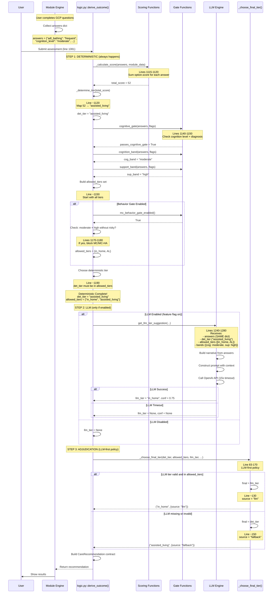

**Key Takeaway**: The `answers` dictionary flows through THREE stages:
1. **Deterministic scoring** (always) - calculates score and base tier
2. **LLM suggestion** (optional) - same answers sent to AI with deterministic result as context
3. **Adjudication** (always) - chooses between LLM (if valid) and deterministic (fallback)

---

## 1. GCP Assessment Flow (with LLM)

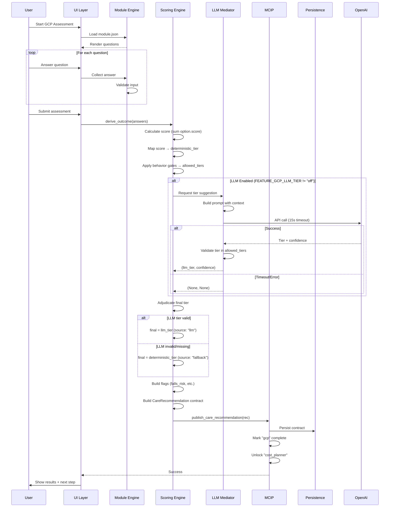

---

## 2. Cost Planner Quick Estimate Flow

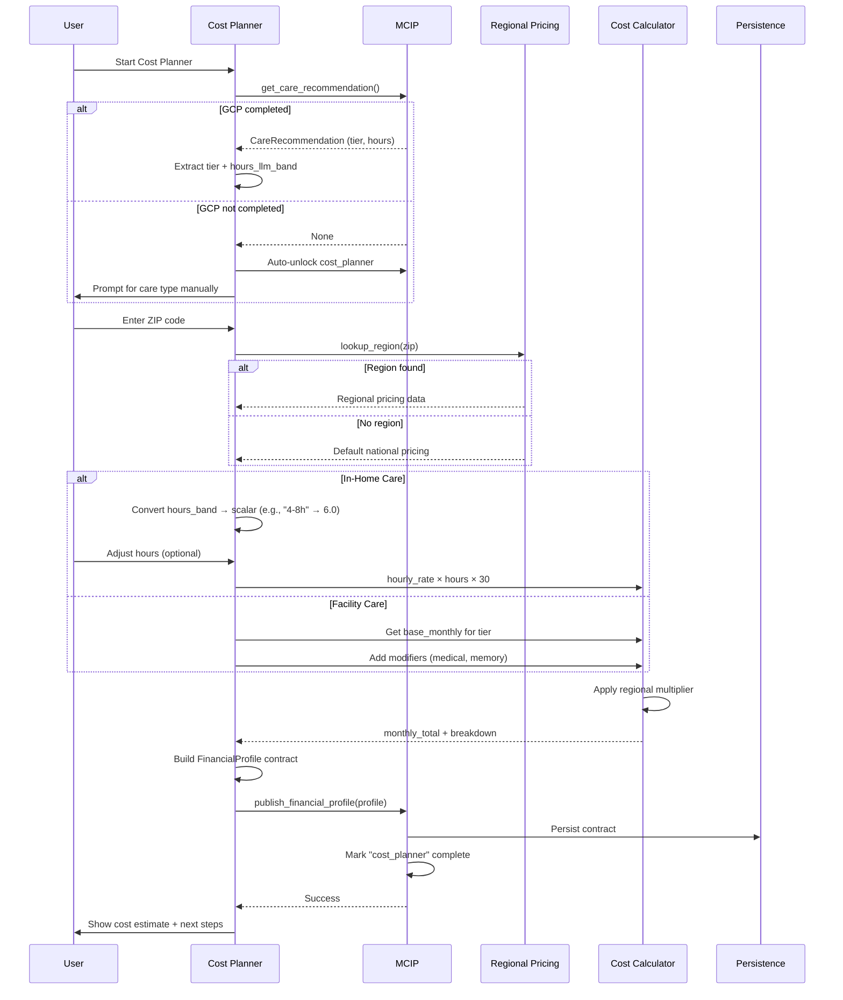

---

## 3. MCIP Contract Publishing Flow

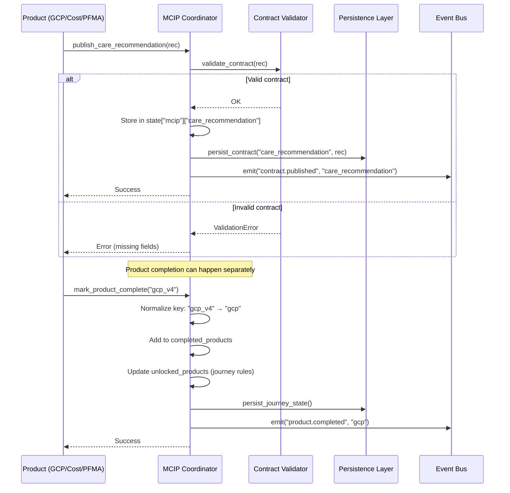

---

## 4. LLM-First Adjudication Policy

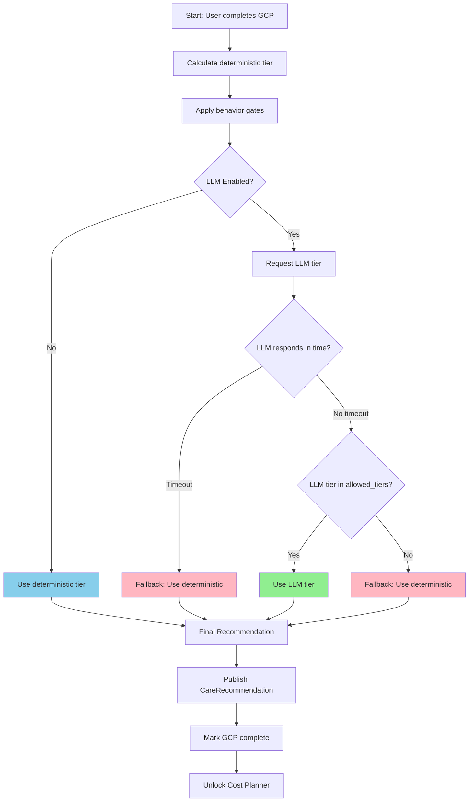

**Key Insight**: LLM gets first chance, but deterministic is always ready as fallback.

---

## 5. Behavior Gate Decision Logic

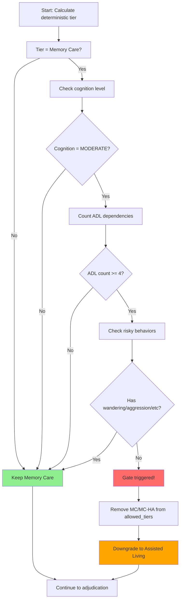

**Rule**: Moderate cognition + high support needs = AL, unless risky behaviors present.

---

## 6. JSON Configuration Loading & Caching

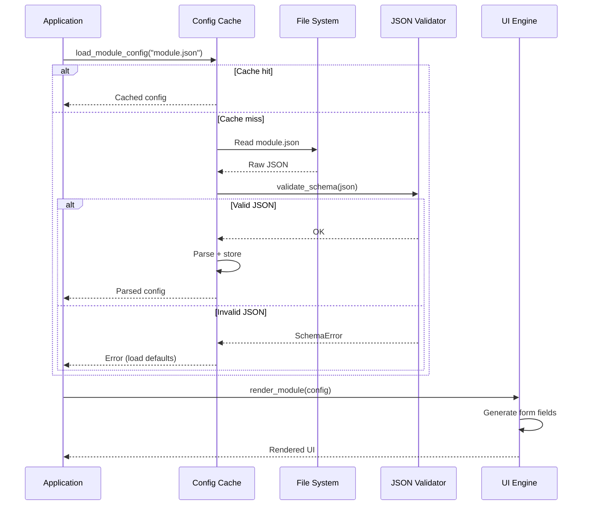

**Key Point**: Configuration is loaded once, validated, cached. UI is generated dynamically from JSON.

---

## 7. Multi-Product Journey Flow (Hub Navigation)

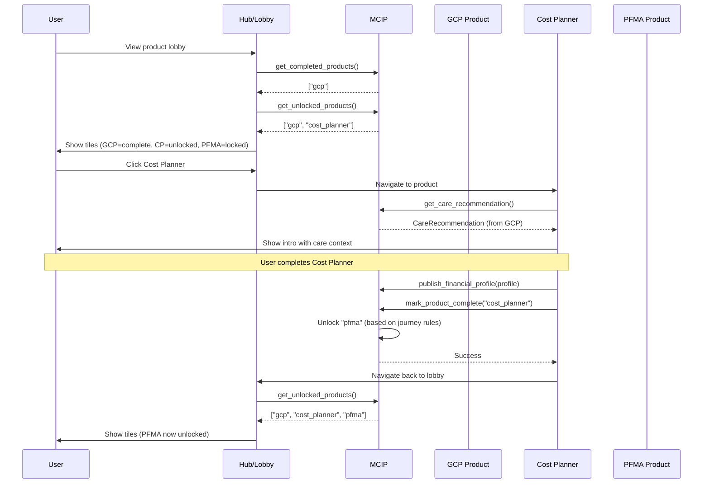

**Journey Gating**: Products unlock based on completion rules in MCIP.

---

## 8. Regional Pricing Lookup Flow

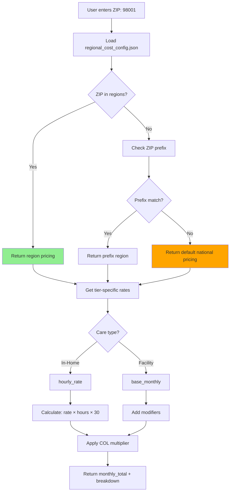

**Fallback Strategy**: ZIP → Prefix → Default (always returns a price).

---

## 9. Hours Recommendation Integration

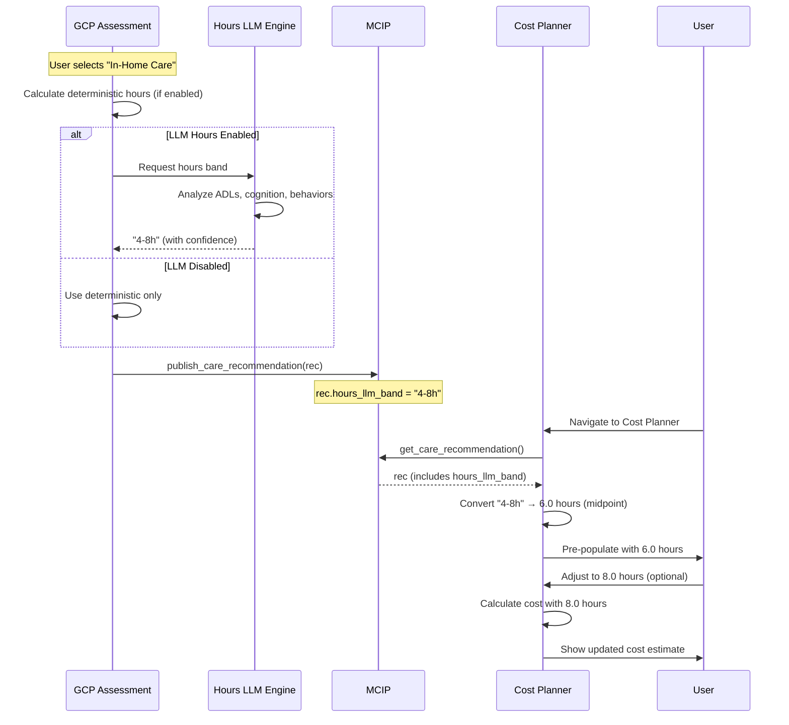

**Key**: Hours flow from GCP → MCIP → Cost Planner, user can override.

---

## 10. Error Handling & Fallback Strategy

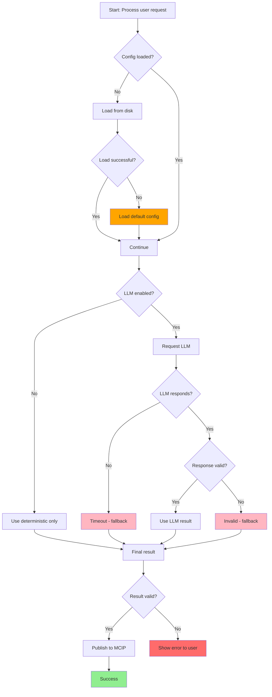

**Principle**: Every step has a fallback. System never fails completely.

---

## Key Observations for Developers

### Critical Patterns

1. **Defensive Loading**: Always have defaults for config files
2. **Timeout Discipline**: LLM calls must timeout (15s max)
3. **Validation Everywhere**: Validate LLM responses, user inputs, contract fields
4. **Fallback Chain**: LLM → Deterministic → Default
5. **Idempotent Publishing**: Publishing same contract twice is safe

### State Transitions

```
Product States:
  locked → unlocked → in_progress → complete

Contract States:
  None → draft → published → archived

LLM States:
  off → shadow → assist → replace
```

### Integration Points

| From | To | Via | Data |
|------|-----|-----|------|
| GCP | Cost Planner | MCIP | CareRecommendation |
| Cost Planner | PFMA | MCIP | FinancialProfile |
| Any Product | MCIP | Direct call | Contracts |
| MCIP | Persistence | Auto-save | All contracts |

---

## Testing Scenarios

### Scenario 1: Happy Path (with LLM)
1. User completes GCP
2. LLM suggests tier (valid)
3. Tier published to MCIP
4. User navigates to Cost Planner
5. Cost Planner reads GCP recommendation
6. Cost calculated successfully
7. Financial profile published

**Expected**: All products complete, contracts valid.

---

### Scenario 2: LLM Timeout
1. User completes GCP
2. LLM times out (>15s)
3. **Fallback to deterministic tier**
4. Tier published to MCIP (source: "fallback_timeout")
5. Rest of flow continues normally

**Expected**: System works perfectly without LLM.

---

### Scenario 3: Direct Cost Planner Access
1. User navigates to Cost Planner (skips GCP)
2. Cost Planner checks MCIP for CareRecommendation
3. **None found**
4. Cost Planner auto-unlocks itself
5. User manually selects care type
6. Cost calculated with defaults

**Expected**: Cost Planner works standalone.

---

### Scenario 4: Behavior Gate Triggered
1. User answers: moderate cognition + 5 ADLs + no risky behaviors
2. Deterministic tier: Memory Care
3. **Gate blocks Memory Care**
4. Allowed tiers: [Assisted Living, In-Home]
5. LLM suggests Memory Care
6. **Adjudication rejects LLM (not in allowed_tiers)**
7. Final tier: Assisted Living (source: "fallback_gate")

**Expected**: Gate overrides both deterministic and LLM.

---

**Document Version**: 1.0  
**Companion To**: ARCHITECTURE_FOR_REPLATFORM.md  
**Last Updated**: 2025-11-07
